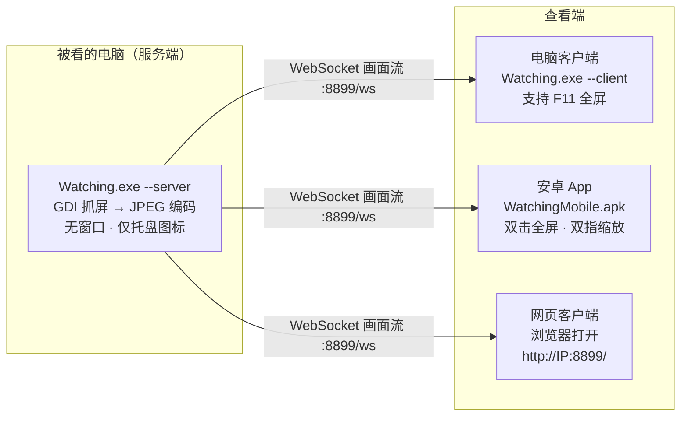

# Watching · 局域网远程屏幕查看

<p align="center">
  <b>一个自己写的局域网看屏工具：电脑服务端静默抓屏，手机 / 电脑客户端按 IP 连上去看。</b><br />
  <sub>Windows 服务端 + Windows 客户端 + 安卓原生 APK + 网页客户端 · 全程不经过任何外部服务器</sub>
</p>

<p align="center">
  
  
  
  
  
</p>

<p align="center">
  <a href="https://ngm1145145-cyber.github.io/watching/">🌐 项目主页</a> ·
  <a href="#五分钟上手">五分钟上手</a> ·
  <a href="#下载">下载</a>
</p>

<p align="center">
  仓库镜像：
  <a href="https://github.com/ngm1145145-cyber/watching">GitHub</a> ·
  <a href="https://gitee.com/ngm1145145-cyber/watching">Gitee</a> ·
  <a href="https://gitcode.com/ngm1145145/watching">GitCode</a>
</p>

---

## 下载

| 平台 | 下载安装包 | 源码仓库 |
| --- | --- | --- |
| **Gitee**（国内推荐） | [Releases](https://gitee.com/ngm1145145-cyber/watching/releases) | <https://gitee.com/ngm1145145-cyber/watching> |
| **GitHub** | [Releases](https://github.com/ngm1145145-cyber/watching/releases/latest) | <https://github.com/ngm1145145-cyber/watching> |
| **GitCode** | [仓库首页](https://gitcode.com/ngm1145145/watching) | <https://gitcode.com/ngm1145145/watching> |

需要的东西一共三个文件：

| 文件 | 大小 | 给谁用 |
| --- | --- | --- |
| `Watching-win-x64-selfcontained.zip` | 64.6 MB | **被看的电脑 + 查看的电脑**（自带运行时，解压即用） |
| `Watching-win-x64-framework.zip` | 0.16 MB | 同上，但目标机需装 .NET 10 桌面运行时 |
| `WatchingMobile-1.0.7.apk` | 39.4 MB | 安卓手机 |

> 如果某个平台的 Release 里暂时没有附件，也可以只克隆源码，本地跑
> `build-release.ps1` / `build-apk.ps1` 自己编译（见[从源码构建](#从源码构建)）。

---

## 这是什么

`Watching` 把一台 Windows 电脑的屏幕，实时投给**同一局域网内**的手机或另一台电脑。

- **服务端**跑在被看的电脑上：**没有任何窗口**，只在右下角托盘留一个小图标；没人看的时候连一帧都不抓。
- **查看端**有三种：安卓 App（原生 APK）、Windows 桌面客户端、浏览器网页。
- 连接方式就是 **IP 地址 + 端口**（默认 `8899`），不依赖公网、不依赖云、没有账号体系。
- **默认只能看，不能操作**；需要远程控制必须由被看的那台电脑自己在设置里打开并过密码。



---

## 目录

- [功能一览](#功能一览)
- [五分钟上手](#五分钟上手)
- [手机端：装 App 还是用网页](#手机端装-app-还是用网页)
- [设置与密码规则](#设置与密码规则)
- [远程控制（默认关闭）](#远程控制默认关闭)
- [命令行参数](#命令行参数)
- [从源码构建](#从源码构建)
- [工作原理](#工作原理)
- [项目结构](#项目结构)
- [常见问题](#常见问题)
- [已验证 / 未验证](#已验证--未验证)
- [License](#license)

---

## 功能一览

| 能力 | 说明 |
| --- | --- |
| 🖥️ 服务端完全静默 | 没有窗口、没有任务栏图标，只有托盘小图标；退出请右键托盘 |
| 🔒 没人看不干活 | 只有存在观看端时才启动抓屏线程，无人观看时 CPU 占用为 0 |
| 📱 安卓原生 App | C# 写的 `.NET for Android` 应用，双击全屏、双指缩放、沉浸式显示 |
| 🌐 免安装网页端 | 服务端内嵌网页，任何浏览器打开 `http://服务端IP:8899/` 就能看 |
| 🖼️ 画质自适应 | 每个客户端可独立选 流畅 / 中 / 高清，互不影响 |
| 📉 自动丢帧 | 只发最新帧、跟不上就丢，永远不会越看越卡 |
| 🧩 按需裁剪 | 协议支持只传屏幕的一块区域（省流量） |
| 🔑 两级密码 | ①进设置要密码（PBKDF2 哈希存储）②客户端连接可选访问密码 |
| 🖱️ 远程控制 | 默认关闭；开启后支持鼠标移动/点击/滚轮与键盘输入 |
| 🚀 开机自启 | 一键写入当前用户启动项，开机静默待命 |
| 🧱 零第三方依赖 | 网络层（HTTP + WebSocket）与抓屏编码全部自己实现，无 NuGet 包 |

---

## 五分钟上手

假设：**A = 被看的电脑**，**B = 你手上的手机或另一台电脑**。两者连同一个 WiFi / 局域网。

### 1️⃣ 在 A 上启动服务端

下载 Release 里的 `Watching-win-x64-selfcontained.zip`，解压后双击：

```text
shortcuts\1-启动服务端.bat
```

等价于命令行：

```powershell
Watching.exe --server
```

启动后 A 上**看不到任何窗口**，只有右下角托盘多出一个蓝色眼睛图标。

> **⚠ 首次使用请先放行防火墙**：Windows 默认阻止入站连接，不放行的话手机 / 别的电脑永远连不上。
> 最简单的方式：**托盘图标右键 →「⚠ 一键放行防火墙」**（弹一次 UAC 确认即可，会自动加 TCP + UDP 两条规则）。
> 也可以在托盘右键 →「网络自检」里看结论，或管理员运行 `shortcuts\4-添加防火墙规则.bat`。

**怎么知道 A 的 IP？** 有三种办法：

1. **客户端自动搜索**（推荐）：电脑客户端点「搜索服务端」，手机 App 点「搜索局域网服务端」，
   通过 UDP 广播自动找到并填好 IP。
2. 托盘图标右键，菜单里直接列出手机可访问的地址，例如 `手机访问：http://192.168.1.8:8899/`。
3. 运行 `shortcuts\3-查看手机访问地址.bat`。

### 2️⃣ 在 B（电脑）上看

解压同一份文件，双击：

```text
shortcuts\2-启动电脑客户端.bat
```

它会问你 IP，输入 `192.168.1.8` 回车即可。也可以直接带参数启动：

```powershell
Watching.exe --client --connect 192.168.1.8
Watching.exe --client --connect 192.168.1.8:8899 --password 1234
```

连上以后：

| 操作 | 效果 |
| --- | --- |
| `F11` | 进入 / 退出全屏 |
| `Ctrl` + 滚轮 | 缩放画面 |
| 拖动画面 | 平移（非适应窗口状态） |
| 顶部按钮 | 画质循环 / 适应窗口 / 截图 / 全屏 / 断开 |

### 3️⃣ 在 B（手机）上看

**方式一：装 APK（推荐）** —— 把 `dist/apk/WatchingMobile-1.0.7.apk` 传到手机安装
（或数据线连上后 `adb install -r WatchingMobile-1.0.7.apk`）。
打开 App → 填 `192.168.1.8` 和端口 `8899` → 「开始观看」。

**方式二：用浏览器** —— 手机浏览器打开 `http://192.168.1.8:8899/` → 「开始观看」，免安装。

> 手机首次安装需要在系统设置里允许「安装未知来源的应用」；
> APK 使用 Android 调试证书签名，个人安装没有任何问题。

### 4️⃣（可选）把服务端设为开机自启

托盘图标右键 → **设置…** → 勾选「开机自动启动服务端（静默后台运行）」→ 保存。

---

## 手机端：装 App 还是用网页

|  | 安卓 App（APK） | 网页客户端 |
| --- | --- | --- |
| 需要安装 | 是（39 MB） | 否 |
| 支持系统 | Android 7.0+ | 任意现代浏览器（含 iPhone） |
| 全屏 | 沉浸式全屏（隐藏状态栏/导航栏） | 浏览器全屏 API，iPhone 回退为伪全屏 |
| 缩放 | 双指捏合 + 拖动 | 双指捏合 + 拖动 |
| 流量 | 与网页版相同（同一套帧协议） | 同左 |
| 适合 | 安卓手机日常使用 | iPhone、临时借用别人的设备 |

安卓 App 额外支持：

- 记住上次连接的地址，下次打开直接连
- 退到后台自动断开省电，回到前台自动重连
- 支持 `watching://?ip=192.168.1.8&port=8899&pwd=xxx` 链接直接拉起并连接
- 支持 `adb` 无线/有线安装，不需要应用商店

---

## 设置与密码规则

设置界面**没有主窗口**，入口是：**托盘图标右键 → 设置…**（双击托盘图标也可以）。

密码规则（就是按需求实现的，两条）：

| 情况 | 行为 |
| --- | --- |
| **从来没有设置过密码** | 可以直接进设置，界面里会提示「尚未设置密码」并引导你设一个 |
| **已经设置过密码** | 必须先输入正确密码才能进设置；输错提示「密码不正确」，弹窗不关闭 |
| **尝试开启远程控制** | 需要已有密码，并且**再验证一次**；验证失败则远程控制保持关闭 |

设置项：

| 分组 | 项目 | 说明 |
| --- | --- | --- |
| 远程控制 | 允许客户端远程控制本机鼠标和键盘 | 默认**关闭**，需要密码 |
| 画面质量 | 帧率 | 1–60 fps |
|  | 画质 | JPEG 质量 20–95 |
|  | 发送宽度 | 480–3840，越小越省流量 |
| 安全 | 客户端连接需要访问密码 | 打开后所有查看端都要输密码，可一键生成随机密码 |
|  | 设置密码 / 修改密码 | 保护设置界面本身 |
| 启动方式 | 开机自动启动服务端 | 写入当前用户启动项，无需管理员权限 |

> 配置保存在 `%AppData%\Watching\config.json`。
> 设置密码用 **PBKDF2-SHA256（12 万次迭代 + 随机盐）** 存哈希并做恒定时间比较，不保存明文。
> 忘了密码？关掉服务端，把 `config.json` 里的 `PasswordHash` / `PasswordSalt` 两行删掉即可。

---

## 远程控制（默认关闭）

`Watching` 出厂状态是**只能看**。要允许操作：

1. 托盘右键 → 设置 → 打开「允许客户端远程控制本机鼠标和键盘」；
2. 系统会要求你输入设置密码再确认一次；
3. 保存后各客户端会显示「可远程控制」，这时才允许发操作指令。

### 四种客户端分别怎么操作

| 客户端 | 怎么开启 | 能做什么 |
| --- | --- | --- |
| **电脑客户端**（WPF） | 连接栏的「允许远程控制」勾上（服务端允许时自动勾选） | 移动鼠标即移动对方光标、左/右键点击、滚轮、键盘输入（含 Ctrl/Alt/Shift/Win 组合键） |
| **安卓 App** | 顶部点 **「控制:关」** 切成「控制:开」 | 点按 = 左键单击、拖动 = 按住左键拖动、**长按 = 右键单击**、**双指上下滑 = 滚轮**、双指捏合 = 缩放；点 **「键盘」** 调出输入法打字 |
| **电脑网页客户端** | 顶栏点 **「控制:关」** 切成「控制:开」 | 点击/拖动、滚轮、键盘（F11 仍是网页全屏） |
| **手机网页客户端** | 顶部点 **「控制:关」** 切成「控制:开」 | 同安卓 App（点按/拖动/长按右键/双指滑动滚动 + 「键盘」按钮） |

**触摸手势一览（安卓 App 与手机网页完全一致）：**

| 手势 | 效果 | 说明 |
| --- | --- | --- |
| 单指点按 | 左键单击 | 手指落在哪，对方光标就跳到哪（绝对定位） |
| 单指按住拖动 | 按住左键拖动 | 位移超过 8px 才升级为按住，避免"想点一下却变成拖" |
| **单指长按 480ms** | **右键单击** | 松手前不动才会触发；触发后手机轻微振动一下，状态条显示「已发送右键单击」 |
| **双指上下滑** | **滚轮上下滚** | 手指上滑 = 内容跟着往上走（等同滚轮向下），每 60px 算一格 |
| 双指捏合/张开 | 缩放画面 | 两指距离变化超过 ±15% 就判定为缩放，不会误发滚轮 |
| 「键盘」按钮 | 键盘输入 | 中文/表情走 Unicode 注入 |

**安卓 App 具体操作步骤：**

1. 连接成功后，顶部信息条会显示「可远程控制」，下面出现 **「控制:关」** 按钮。
2. 点它变成 **「控制:开」**（会自动切到「适应屏幕」，让手指位置和真实坐标一一对应）：
   - **单指点按** → 对方电脑上一次左键单击
   - **按住并拖动** → 按住左键拖动（拖窗口、划选文字）
   - **长按约半秒** → 对方电脑上一次右键单击（弹出右键菜单）
   - **双指上下滑** → 滚轮滚动（看网页、滚动列表）
   - **双指捏合** → 仍然是缩放查看，不会误操作对方
3. 打字：点 **「键盘」** → 弹出输入法 → 输入内容发到对方电脑（支持退格、回车、
   中文/表情走 Unicode 注入）。
4. 再点一次「控制:开」回到只读模式。

> **为什么长按是 480ms？** 安卓系统默认的长按阈值约 500ms 且不可调，而系统默认的
> 「长按」在旧版本里会和双击（切换全屏）冲突。控制模式下我们**不再把触摸交给系统手势识别器**，
> 而是自己计时：480ms 内松手 = 单击，超时未动 = 右键，中途移动超过 8px = 取消长按改为拖动。
> 所以控制模式下**双击不再切换全屏**，请用顶部的全屏按钮。

> 开启控制后画面会出现**蓝色描边**作为提示，避免误操作。
> 服务端没开远程控制时，按钮显示 **「控制:不可用」**，点它会提示去服务端哪里打开。

### 实现方式

服务端通过 `SendInput` 注入输入事件，坐标从客户端的归一化坐标（0–1）换算到屏幕绝对像素。
支持的指令：`move` / `down` / `up` / `click` / `wheel` / `key`（带 ctrl/alt/shift/win）。

> ⚠️ **看不到鼠标？** Windows 的抓屏 API 本身不含光标，所以服务端会额外用
> `GetCursorInfo` + `DrawIconEx` 把光标画进画面（设置里可关，默认开）。
>
> ⚠️ 如果目标窗口以管理员身份运行，Windows 的 UIPI 机制会拒绝普通权限进程的注入；
> 需要控制这类窗口时，请以管理员身份运行服务端。客户端状态栏也给了这条提示。

---

## 命令行参数

同一个 `Watching.exe` 用参数切换角色：

```powershell
# 服务端
Watching.exe --server
Watching.exe --server --port 9000
Watching.exe --server --fps 25 --quality 60 --width 1280
Watching.exe --server --config D:\watching2.json     # 多实例 / 独立配置

# 电脑客户端
Watching.exe --client
Watching.exe --client --connect 192.168.1.8
Watching.exe --client --connect 192.168.1.8:8899 --password 1234
Watching.exe --client --connect 192.168.1.8 --fullscreen   # 连上直接全屏
```

| 参数 | 说明 |
| --- | --- |
| `--server` / `-s` | 以服务端身份启动（静默后台 + 托盘） |
| `--client` / `-c` | 以电脑客户端身份启动（默认） |
| `--connect <IP[:端口]>` | 客户端启动后自动连接该地址 |
| `--host <IP>` | 只指定地址，不自动连接 |
| `--port` / `-p` | 端口，默认 `8899` |
| `--fps` | 服务端帧率上限 |
| `--quality` / `-q` | 服务端 JPEG 画质 |
| `--width` / `-w` | 服务端发送宽度上限（0 = 原始分辨率） |
| `--password` / `--pwd` | 客户端的访问密码 |
| `--config <路径>` | 指定配置文件位置 |
| `--fullscreen` / `-f` | 客户端启动即全屏 |

---

## 从源码构建

### 环境要求

| 组件 | 版本 | 用途 |
| --- | --- | --- |
| .NET SDK | **10.0** | Windows 端（服务端 + 客户端） |
| JDK | **17** | 安卓端编译 |
| Android SDK | platform 36 + build-tools 36.0.0 + platform-tools | 安卓端编译 |

### Windows 端（服务端 + 电脑客户端）

```powershell
git clone <你的仓库地址>
cd watching

# 自包含版（自带运行时，约 154 MB，拷过去就能跑）
powershell -ExecutionPolicy Bypass -File .\build-release.ps1

# 轻量版（约 0.4 MB，目标机需装 .NET 10 桌面运行时）
powershell -ExecutionPolicy Bypass -File .\build-release.ps1 -FrameworkDependent
```

产物在 `dist\Watching-win-x64-selfcontained\` 与 `dist\Watching-win-x64-framework\`，各自带一个 `shortcuts\` 文件夹。

### 安卓端（APK）

```powershell
# 需要 JDK 17；Android SDK 路径可以用 -SdkDir 指定
powershell -ExecutionPolicy Bypass -File .\build-apk.ps1 `
    -SdkDir "D:\android-sdk" -JdkDir "C:\Program Files\Eclipse Adoptium\jdk-17"
```

产物：`dist\apk\WatchingMobile-1.0.7.apk`（约 39 MB，含 arm64-v8a 与 armeabi-v7a）。

安装：

```bash
adb install -r dist/apk/WatchingMobile-1.0.7.apk
```

> 首次编译安卓端需要 `.NET android` 工作负载：`dotnet workload install android`。
> 还没装 Android SDK？可以用命令行工具装：
> `sdkmanager --sdk_root=<SDK路径> "platform-tools" "platforms;android-36" "build-tools;36.0.0"`

---

## 工作原理

### 端口与地址

| 地址 | 用途 |
| --- | --- |
| `0.0.0.0:8899` | 服务端监听（所有网卡），可用 `--port` 修改 |
| `ws://IP:8899/ws` | 画面流（WebSocket 二进制帧） |
| `http://IP:8899/` | 手机网页客户端 |
| `http://IP:8899/pc` | 电脑网页客户端 |
| `http://IP:8899/api/info` | 设备信息（JSON） |
| `http://IP:8899/api/snapshot` | 当前画面单张 JPEG 截图 |
| `http://IP:8899/health` | 健康检查 |

### 帧格式

每一帧就是一条 WebSocket 二进制消息，前 268 字节是自描述头，后面是内容。
`mode` 字段区分两种帧：

**整帧（`mode = "full"`）**

```text
偏移   长度    内容
0      4      魔数 "WF01"
4      8      帧序号（小端 int64，客户端据此判断是否新帧）
12     256    JSON 元数据（不足补 \0）
              {"w":宽,"h":高,"sw":屏幕宽,"sh":屏幕高,"q":画质,"crop":是否裁剪,
               "ts":时间戳,"mode":"full","capMs":抓屏耗时,"tile":128,"tx":11,"ty":6}
268    剩余   整帧 JPEG
```

**增量帧（`mode = "delta"`）—— 只含上一次之后变化的分块**

```text
偏移   长度        内容
0      268        同上（mode = "delta"）
268    4          分块表魔数 "DT01"
272    4          分块数 n（小端 int32）
276    n × 8      每个分块：x(2 字节大端) + y(2 字节大端) + JPEG长度(4 字节小端)
276+8n 剩余       n 个分块 JPEG 依次排列
```

客户端拿到增量帧后，把每个分块 JPEG 解码并贴到上一帧对应坐标上，就得到完整画面。

控制消息是 WebSocket 文本帧 JSON，`t` 字段区分类型：
`hello` / `welcome` / `quality` / `crop` / `input` / `state` / `ping` / `pong` / `error`。

### 采样与传输

```text
客户端接入
   ↓
CaptureHub 按 (画质, 帧率, 宽度, 裁剪区域) 分配一条抓屏流
   ↓
抓屏线程：GDI BitBlt（32bpp 缓冲）→ 缩放 → 系统 JPEG 编码器
   ↓
分块增量编码：画面切成 128×128 的块，逐块和上一帧比（带噪声容差），
             只把变化的块编码成小 JPEG；变化过大或到关键帧周期时发整帧
   ↓
每个客户端一条发送线程：取最新的可发送内容 → 推送（跟不上就丢帧）
   ↓
最后一个客户端断开 → 抓屏线程退出 → 抓屏流被回收，服务端回到零开销
```

### 分块增量传输（更小流量 + 更流畅）

整帧发送时，哪怕只动了一个鼠标指针也要把整屏 JPEG 传一遍。所以服务端改成**只传变化的分块**：

| | 整帧方案 | 分块增量 |
| --- | --- | --- |
| 静止桌面 | 每帧照发（或靠整帧去重跳过） | **一帧都不发** |
| 移动鼠标 / 打字 | 发整屏 | 只发变化的 1~3 块 |
| 客户端解码量 | 每帧解码整屏 | 只解码变化的小块 |
| 实测：1366×768，只有 3/66 块变化 | 83.6 KB/帧 | **5.8 KB/帧（省 93%）** |
| 实测：连续 100 帧各改一小块 | 8.2 MB | **0.1 MB（省 98%）** |
| 实测：真实桌面（在放视频，变化剧烈） | — | **省 72%** |

实现要点：

- **分块比较带噪声容差**：块内平均像素差 ≤3 就算没变。用精确哈希会被渲染噪声骗到，
  每块都判成「变了」，增量就永远不触发（开发中踩过这个坑）。
- **关键帧回退**：首次、画面尺寸变化、变化面积超过 45%、或每 150 帧都会发整帧，
  保证客户端随时能重建完整画面。
- **零变化帧直接省略**：一块都没变时连帧序号都不递增，客户端不会收到空帧。
- **改画质/尺寸后自动补关键帧**，否则客户端拼出来的画面是花的。
- 三端客户端都做**分块合成**：WPF 用 `WriteableBitmap.WritePixels`，网页用离屏 `canvas`，
  安卓用可变 `Bitmap` + `Canvas`，都只在变化区域上绘制。

配合其它优化，整体效果：

| 优化 | 作用 |
| --- | --- |
| 分块增量 | 只传变化区域（省 70%~98%） |
| 静止帧跳过 | 完全没变化时一帧都不发 |
| 只发最新帧 | 客户端跟不上就丢旧帧，永不积压 |
| 拥塞自适应 | 单帧发送耗时超标 → 自动降画质，恢复后升回 |
| 直写 socket | 不再每帧拼接大数组，单帧发送 0~1ms |
| Socket 调优 | NoDelay / 256KB 发送缓冲 / KeepAlive |
| 独立画质 | 每个客户端可单独选 流畅 / 中 / 高清 |
| 多客户端共享 | 请求相同画面的客户端复用同一条抓屏流 |

### 为什么服务端「不显示任何东西」

服务端进程**不创建主窗口**（WPF 以 `ShutdownMode = OnExplicitShutdown` 运行），只有托盘图标，
而托盘图标不参与桌面画面合成，因此不会出现在被抓取的画面里，也不会挡住被看的内容。

---

## 项目结构

```text
watching/
├─ build-release.ps1            Windows 端一键发布（自包含 / 轻量）
├─ build-apk.ps1                安卓端一键编译 APK
├─ README.md
├─ docs/                        项目介绍网页（可挂 GitHub / Gitee Pages）
│   └─ index.html               单文件落地页，零外部依赖（可自行加截图）
├─ scripts/                     便利脚本文本（发布时复制为 shortcuts\）
│   ├─ 1-启动服务端.bat
│   ├─ 2-启动电脑客户端.bat
│   ├─ 3-查看手机访问地址.bat
│   ├─ 4-添加防火墙规则.bat       （管理员，放行 8899）
│   ├─ 5-网络诊断.bat
│   └─ 6-编译安装手机客户端.bat
├─ src/
│   ├─ Watching/                Windows 服务端 + 电脑客户端（WPF，共用一个 exe）
│   │   ├─ App.xaml(.cs)        启动分流：--server / --client
│   │   ├─ Common/              配置、密码门禁、协议、单实例、日志
│   │   ├─ Server/
│   │   │   ├─ ServerHost.cs        总控：抓屏流 / 客户端登记 / 设置广播
│   │   │   ├─ CaptureHub.cs        按需创建与回收抓屏流
│   │   │   ├─ CaptureEngine.cs     抓屏循环（无人观看时完全不动）
│   │   │   ├─ ScreenEncoder.cs     GDI 抓屏 + JPEG 编码（复用位图）
│   │   │   ├─ ClientConnection.cs  单个客户端的收发 / 画质 / 裁剪 / 丢帧 / 静态跳帧 / 自适应码率
│   │   │   ├─ NetServer.cs         内置 HTTP + WebSocket 服务器（含 socket 调优）
│   │   │   ├─ WebSocketProtocol.cs RFC6455 服务端实现 + 帧封装（零拷贝直写）
│   │   │   ├─ FirewallHelper.cs    Windows 防火墙查询与一键放行（netsh + UAC）
│   │   │   ├─ NetworkDiagnostics.cs 网络自检：网卡枚举 / 可用性判断 / 结论
│   │   │   ├─ DiscoveryService.cs  UDP 自动发现（应答探测 + 定时广播）
│   │   │   ├─ InputInjector.cs     远程鼠标键盘注入（SendInput）
│   │   │   ├─ TrayIcon.cs          托盘图标与菜单
│   │   │   ├─ SettingsWindow.xaml  设置界面
│   │   │   ├─ PasswordDialog.xaml  密码弹窗
│   │   │   ├─ LogWindow.xaml       日志窗口
│   │   │   └─ AutoStartHelper.cs   开机自启
│   │   ├─ Desktop/             电脑客户端
│   │   │   ├─ FrameClient.cs       WebSocket 客户端（重连 / 丢帧 / 统计）
│   │   │   ├─ DiscoveryClient.cs   UDP 搜索服务端（客户端侧）
│   │   │   ├─ MainWindow.xaml      连接栏 + 画面 + 状态栏
│   │   │   ├─ ScreenView.xaml      画面控件（缩放 / 全屏 / 输入 / 截图）
│   │   │   └─ FullscreenWindow.xaml 无边框全屏
│   │   └─ web/                 内嵌网页客户端（编译进 exe，随 HTTP 服务发出）
│   │       ├─ mobile/          手机网页版
│   │       └─ pc/              电脑网页版
│   └─ WatchingMobile/          安卓原生 App（C#）
│       ├─ WatchingMobile.csproj
│       ├─ Properties/AndroidManifest.xml
│       ├─ MainActivity.cs      全部界面（纯 C# 构建）+ 沉浸式全屏 + 触摸手势（点按/拖动/长按右键/双指滚动）
│       ├─ ScreenImageView.cs   画面控件：等比缩放 / 捏合 / 拖动 / 双击 / 控制模式下接管单指与双指手势
│       ├─ Resources/           图标 PNG（5 种密度，API 24 上矢量图标会闪退）、颜色、主题
│       └─ Net/
│           ├─ WsSession.cs     自己实现的 RFC6455 WebSocket 客户端
│           ├─ Protocol.cs      "WF01" 帧解析 + 控制消息
│           ├─ UdpDiscovery.cs  UDP 搜索服务端（含安卓 MulticastLock）
│           └─ ScreenClient.cs  连接 / 重连 / 丢帧 / 密码错误识别 / 统计
├─ tools/                       联调与验证工具
│   ├─ test-client.mjs          Node 收帧 + 校验协议 + 存图
│   ├─ test-auth.mjs            验证访问密码是否真的生效
│   ├─ test-input.mjs           验证远程鼠标注入
│   ├─ browser-verify.mjs       用 Chrome DevTools 协议验证网页客户端/落地页
│   ├─ gesture-verify.mjs       ⚠会动鼠标：验证触摸手势 → 控制消息（7 项）
│   ├─ inject-verify.mjs        ⚠会动鼠标：验证控制消息 → 真实程序（右键/滚轮 3 项）
│   ├─ serve-static.mjs         本地预览 docs/ 落地页的极简静态服务器
│   └─ ProtocolCheck/           复用安卓 App 的网络源码，在 Windows 上验证协议
└─ dist/                        构建产物（未提交到仓库，见 .gitignore）
    ├─ apk/WatchingMobile-1.0.7.apk
    ├─ Watching-win-x64-selfcontained/
    └─ Watching-win-x64-framework/
```

---

## 项目主页（介绍网页）

仓库里的 `docs/index.html` 是一个**单文件**介绍网页（零外部依赖、无 CDN），三家平台都能托管：

| 平台 | 怎么开 | 地址 |
| --- | --- | --- |
| **GitHub** | Settings → Pages → Source 选 `Deploy from a branch`，分支 `main`、目录 **`/docs`** | <https://ngm1145145-cyber.github.io/watching/> |
| **Gitee** | 仓库 → 服务 → Gitee Pages → 部署目录选 `docs`（部分功能需实名/付费） | `https://ngm1145145-cyber.gitee.io/watching` |
| **GitCode** | 仓库首页会直接渲染根目录 `README.md`；静态页在「项目设置 → Pages」里开启 | — |

> 网页里的三平台链接与下载按钮由 `docs/index.html` 顶部那段配置决定：
> `const REPO_GH = "..."`、`const REPO_GITEE = "..."`、`const REPO_GITCODE = "..."`，改了仓库名同步改这三行即可。
>
> 本地预览：`node tools/serve-static.mjs docs 8099` 然后打开 `http://127.0.0.1:8099/`。

---

## 打 tag 发版

三家平台各自用各自的方式发版（仓库里不再放 CI 工作流）：

```bash
# 打 tag 并推到三家
git tag v1.0.0
git push origin v1.0.0      # GitHub
git push gitee  v1.0.0      # Gitee
git push gitcode v1.0.0     # GitCode
```

然后到各平台的 Releases 页面把 `dist/` 里的三个包拖成附件（Gitee/GitCode 的 Release 也需要手动建）。
如果想让 GitHub 那边**自动构建并发布**，把 `.github/workflows/release.yml` 加回来即可（可参考 git 历史里的 `db36aaf` 那个提交）。

---

## 常见问题

<details>
<summary><b>手机连不上 / 一直转圈？</b></summary>

1. 确认手机和电脑在**同一个 WiFi**（不是手机流量，也不是访客网络）。
2. 在电脑上运行 `shortcuts\5-网络诊断.bat`，它会检查监听状态、本机 IP、防火墙规则。
3. 确认 Windows 防火墙放行了 8899：管理员运行 `shortcuts\4-添加防火墙规则.bat`。
4. 如果是公司/学校网络，可能开了**客户端隔离**，同一 WiFi 的设备互相不通，需要换网络或用手机热点。
</details>

<details>
<summary><b>怎么知道服务端的 IP？</b></summary>

托盘图标右键，菜单第一项下方会直接列出可访问地址；也可以运行 `shortcuts\3-查看手机访问地址.bat`。
IP 形如 `192.168.x.x` 或 `10.x.x.x`，注意不要用 `127.0.0.1`（那是本机回环，手机连不上）。
</details>

<details>
<summary><b>客户端提示「服务端未开启远程控制」？</b></summary>

这是**正常状态**：默认只能看不能操作。需要时在服务端托盘右键 → 设置 → 打开「允许客户端远程控制」，要先设置密码并验证。
</details>

<details>
<summary><b>服务端找不到窗口，怎么退出？</b></summary>

服务端故意没有主窗口。退出方式：**托盘图标右键 → 退出服务端**。
如果托盘图标被折叠了，点任务栏的 `^` 展开隐藏图标区。
</details>

<details>
<summary><b>日志在哪？</b></summary>

`%AppData%\Watching\watching.log`，也可以托盘右键 →「查看日志」实时查看。
</details>

<details>
<summary><b>APK 装不上 / 提示「应用未安装」？</b></summary>

- 安卓 8.0+ 需要在「设置 → 应用 → 特殊权限 → 安装未知应用」里允许你的文件管理器安装。
- 如果之前装过不同签名的版本，先卸载旧的再装。
- 最低支持 Android 7.0（API 24）。
</details>

<details>
<summary><b>App 一打开就闪退？</b></summary>

先看是哪个版本的包。**1.0.0 早期构建里有个已知问题已修复**：启动图标用的是矢量图（`@drawable/appicon`），
Android 7.x 不支持矢量启动图标，会在启动时崩溃。现在已改为标准密度的 PNG 图标（48/72/96/144/192）。

排查步骤：

1. 确认装的是最新包：`apkanalyzer manifest print WatchingMobile.apk | grep icon` 应指向 `mipmap`，
   或直接看 APK 里有没有 `res/mipmap-*/appicon.png`。
2. 用数据线连电脑抓日志（最有用）：
   ```bash
   adb logcat -c && adb logcat | findstr /i "watching AndroidRuntime"
   ```
   打开 App 后，`AndroidRuntime` 那几行会直接写明崩在哪个类、什么异常。
3. App 自己也会在 `Android/data/com.watching.mobile/files/crash.log` 留一份堆栈（如果崩溃发生在启动阶段）。
4. 只编译不重打包也会拿到旧 APK —— 本仓库的 `build-apk.ps1` 已经改成先清 `obj` 再 `dotnet publish`，
   避免增量构建跳过 APK 打包。
</details>

<details>
<summary><b>能跨公网 / 异地使用吗？</b></summary>

可以，但需要自己解决网络互通：把服务端的 8899 端口通过路由器端口转发暴露出去（**强烈建议同时开启客户端访问密码**），
或者用 ZeroTier / Tailscale / WireGuard 之类的虚拟局域网把两端放同一个网段。
`Watching` 本身不提供中转服务器。
</details>

---

## 已验证 / 未验证

为了让你知道哪些地方可以放心、哪些地方要自己试一下：

**已实测通过 ✅**

- 服务端抓屏 → 电脑客户端显示真实画面（能递归看到自己，说明整条链路有效）
- 服务端 → 网页客户端：真实 Chrome 渲染，10 fps / 643 KB/s / 1366×768，无控制台报错
- **安卓 App 的网络层代码**（`WsSession.cs` / `Protocol.cs` 原文）连真实服务端：
  握手 101 → 收 `WF01` 帧 → 解析元数据 → JPEG 解码尺寸正确
- 访问密码：无密码 401 / 错密码 401 / 正确密码 101 并正常收帧
- 密码门禁：无密码可直接进设置；有密码必须输对；开启远程控制需二次验证
- 远程控制门禁：关闭时拒绝注入并回复错误；开启后服务端光标真实移动
- APK 构建与签名：v2 + v3 校验通过，包含 arm64-v8a 与 armeabi-v7a 两套原生库
- **触摸手势 → 控制消息**（`tools/gesture-verify.mjs`，真实浏览器 + 真实服务端，7/7 通过）：
  点按 = `move` + 左键 down/up；长按 480ms = `move` + **右键 down/up**（且不残留左键）；
  拖动 = 1 次左键 down + 多个 move + 1 次 up；双指上滑 = 滚轮 `-120`、下滑 = `+120`；
  双指张开被识别为缩放、不发滚轮
- **控制消息 → 真实程序**（`tools/inject-verify.mjs`，3/3 通过）：注入的右键被一个真实网页收到
  （`contextmenu` 触发 1 次）；滚轮 `-600` 让真实窗口从 0 滚到 500px，`+600` 又滚回 0

**未验证 ⚠️**

- **App 在真机上的界面启动**：构建环境是没有嵌套虚拟化的虚拟机，跑不了安卓模拟器，也没有真机接入。
  App 界面用的是标准 Android API 且通过编译期类型检查，但请在真机上点一下确认；若有闪退欢迎提 Issue 附日志。
- **安卓端的手势是同一套逻辑的另一份实现**（C# / `MotionEvent`，见 `MainActivity.OnRemoteTouch`），
  上面的手势验证跑的是网页端那份；安卓那份只过了编译期检查，没在真机上摸过。

> ⚠️ 上面两个 `*-verify.mjs` 会**真的操作当前这台电脑的鼠标和键盘**（移动光标、点右键、发 Esc、滚动窗口），
> 必须在没人用电脑的时候才跑。它们默认拒绝启动，要显式设置 `WATCHING_ALLOW_INPUT_TESTS=1` 才继续。

---

## License

[MIT](LICENSE) © 2024 Watching contributors

> 仅供个人在自己的设备上使用。用它查看**别人**的电脑属于监控行为，请务必获得对方明确同意，并遵守当地法律法规。
